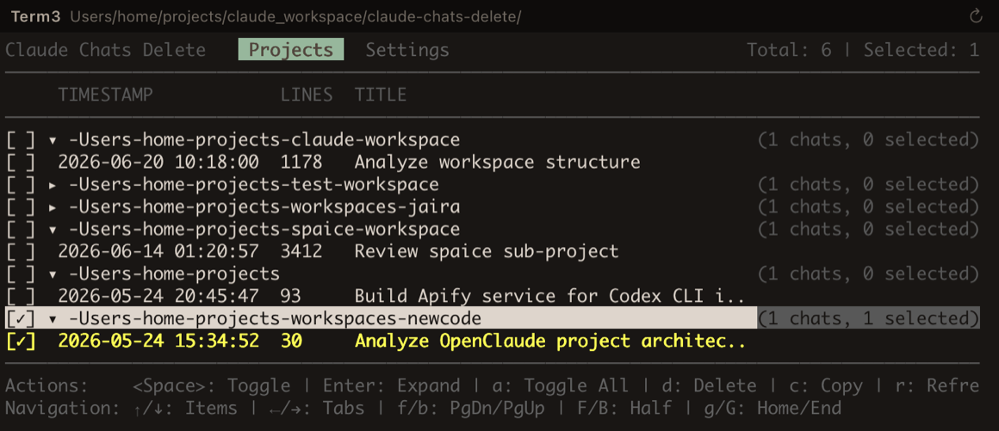
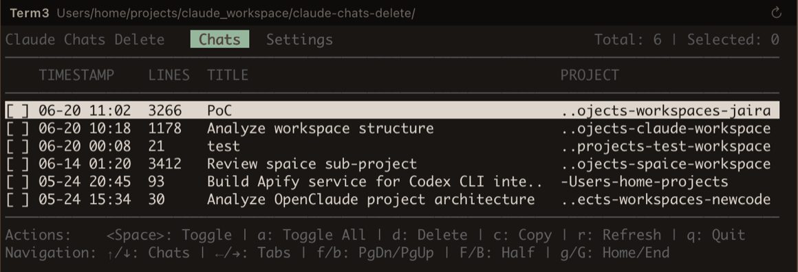

# Claude Code Chats Delete TUI

## 1. Overview

**Delete and remove Claude Code chat sessions** with an interactive terminal UI.

[YouTube Presentation](https://youtu.be/FFmKh5kCyuE)

Browse, select, and bulk delete chat histories stored in `~/.claude` directory.

Tested with Claude Code **v2.1.183**.

**Project view**



**Chats view**



## 2. Features

- Browse chat sessions across all projects, with optional grouped-by-project view
- Bulk delete with full on-disk cleanup (subagents, tool-results, file-history, todos, tasks, plans, agent memory, and more)
- Copy chat UUID to clipboard
- Keyboard-driven interface with vim keys and fast page navigation
- Auto-update via GitHub releases

## 3. What Gets Deleted

Before deleting, see [what gets removed per chat](docs/deletion-behavior.md) -- the full list of files cleaned up for each session.

## 4. Installation

### Quick Install

```bash
curl -sSL https://raw.githubusercontent.com/ataleckij/claude-chats-delete/main/install.sh | sh
```

This will:
- Detect your platform (Linux/macOS, x64/ARM)
- Download the latest release binary
- Verify checksum (SHA256)
- Install to `~/.local/bin/claude-chats`

**Requirements:** curl or wget (usually pre-installed on Linux/macOS)

### Build from Source

See [docs/install-from-source.md](docs/install-from-source.md) for manual build instructions (requires Go 1.21+).

## 5. Usage

```bash
claude-chats
```

### Keyboard Controls

See [docs/keyboard-shortcuts.md](docs/keyboard-shortcuts.md) for the full keybinding reference and tips for large chat histories.

## 6. Updates

The tool checks for updates on startup (once per hour) and prompts you to install when a new version is available. Toggle auto-updates from the **Settings** tab (press `→`), or run `claude-chats --update` for a manual check / `--version` to see the current version.

To disable auto-updates without opening the TUI, set `CLAUDE_CHATS_DISABLE_AUTOUPDATER=1` in your environment.

## 7. Configuration

On first run, you'll be prompted to specify your Claude directory. Configuration is saved to `~/.config/claude-chats/config.json`.

## 8. Star History

<a href="https://www.star-history.com/?repos=ataleckij%2Fclaude-chats-delete&type=date&legend=top-left">
 <picture>
   <source media="(prefers-color-scheme: dark)" srcset="https://api.star-history.com/chart?repos=ataleckij/claude-chats-delete&type=date&theme=dark&legend=top-left" />
   <source media="(prefers-color-scheme: light)" srcset="https://api.star-history.com/chart?repos=ataleckij/claude-chats-delete&type=date&legend=top-left" />
   
 </picture>
</a>

## 9. License

[MIT](LICENSE)
