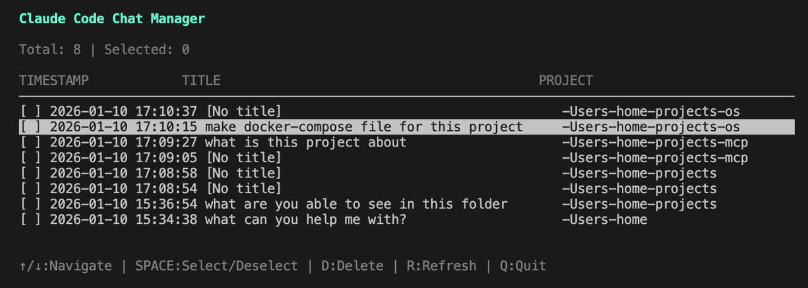

# Claude Code Chats Delete TUI

**Delete and remove Claude Code chat sessions** with an interactive terminal UI.

[YouTube Presentation](https://youtu.be/FFmKh5kCyuE) for [BridgeMind Vibeathon](https://www.bridgemind.ai/vibeathon)

Browse, select, and bulk delete chat histories stored in `~/.claude` directory.

Tested with Claude Code v2.1.114.



## Features

- Browse all chat sessions across projects
- View chat titles, timestamps, versions, line counts, and projects
- Copy chat UUID to clipboard
- Multiple selection with visual indicators
- Delete chats with all related files (subagents, tool-results, file-history, debug, todos, session-env, tasks, plans)
- Keyboard-driven navigation (vim-style support with fast page scrolling)
- Color-coded interface
- Auto-update on startup (checks GitHub for new releases)

## Installation

### Quick Install

```bash
curl -sSL https://raw.githubusercontent.com/ataleckij/claude-chats-delete/main/install.sh | sh
```

This will:
- Detect your platform (Linux/macOS, x64/ARM)
- Download the latest release binary
- Verify checksum (SHA256)
- Install to `~/.local/bin/claude-chats`

**Requirements:** curl or wget (usually pre-installed on Linux/macOS)

### Build from Source

See [docs/install-from-source.md](docs/install-from-source.md) for manual build instructions (requires Go 1.21+).

## Usage

```bash
claude-chats
```

### Keyboard Controls

#### Navigation
| Key | Action |
|-----|--------|
| `↑/↓` or `k/j` | Navigate up/down |
| `f` or `PgDn` | Page down |
| `b` or `PgUp` | Page up |
| `F` | Half page down |
| `B` | Half page up |
| `g` or `Home` | Jump to first chat |
| `G` or `End` | Jump to last chat |

#### Actions
| Key | Action |
|-----|--------|
| `SPACE` | Select/deselect current chat |
| `a` | Select/deselect all chats |
| `c` | Copy chat UUID to clipboard |
| `d` | Delete selected chats, or the chat under cursor if none are selected (with confirmation) |
| `r` | Refresh chat list |
| `q` or `Ctrl+C` | Quit |

> **Tip for Power Users:** Working with hundreds of chats? See [Keyboard Shortcuts Guide](docs/keyboard-shortcuts.md) for advanced navigation tips.

### Deletion Confirmation

When you press `d`:
1. If nothing is selected, the chat under the cursor is auto-selected for this single action (in grouped view, pressing `d` on a project header auto-selects every chat in that project)
2. Confirmation dialog appears
3. Press `ENTER` to confirm deletion
4. Press `ESC` or `n` to cancel — if the selection was made automatically, it is reverted so the next `d` acts on the new cursor position

All related files are deleted:
- Main chat file (`.jsonl`)
- Subagents directory (`<uuid>/subagents/`)
- Tool results directory (`<uuid>/tool-results/`)
- Agent memory (`agents/<agent-id>/memory-local.md`)
- File history (`file-history/<uuid>/`)
- Debug logs (`debug/*.txt`)
- Security warning state (`security_warnings_state_<uuid>.json`)
- Todo files (`todos/*.json`)
- Session environment (`session-env/*/`)
- Task state (`tasks/<uuid>/`)
- Plan files (`plans/*.md`)
- Entry in `sessions-index.json` (updated automatically)

Note: in newer Claude Code versions, debug logs are not written by default unless `/debug` is enabled.

## Updates

The tool automatically checks for updates on startup (once per hour). When a new version is available, you'll be prompted to install it.

### Manual Update Check

```bash
claude-chats --update  # Check for updates manually
claude-chats --version # Show current version
```

### Disable Auto-Updates

Set environment variable:
```bash
export CLAUDE_CHATS_DISABLE_AUTOUPDATER=1
```

Or edit `~/.config/claude-chats/config.json`:
```json
{
  "auto_updates": false
}
```

## Configuration

On first run, you'll be prompted to specify your Claude directory. Configuration is saved to `~/.config/claude-chats/config.json`.

## Claude Directory Structure

The tool manages files in `~/.claude/`:

```
~/.claude/
├── projects/<project>/
│   ├── <uuid>.jsonl              # Main chat file
│   ├── <uuid>/                   # Chat directory
│   │   ├── subagents/            # Subagent conversations
│   │   └── tool-results/         # Tool execution results
│   └── sessions-index.json       # Index of chat sessions
├── file-history/<uuid>/          # File version history
├── debug/<uuid>.txt              # Debug logs
├── todos/<uuid>-*.json           # Todo lists
├── session-env/<uuid>/           # Session environments
├── tasks/<uuid>/                 # Background task state
├── plans/*.md                    # Plan mode files
└── agents/<agent-id>/            # Agent memory (v2.1.33+)
    ├── memory-local.md           # Session-specific memory (deleted)
    ├── memory-project.md         # Project memory (preserved)
    └── memory-user.md            # Global memory (preserved)
```

**Note:** Only `memory-local.md` files are deleted when removing chats. Project and user scope memories are preserved as they may be shared across multiple sessions.

## License

[MIT](LICENSE)
